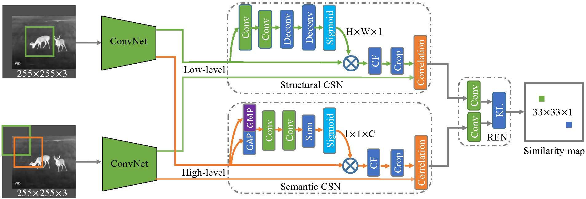

## Learning Deep Multi-Level Similarity  for Thermal Infrared Object Tracking (TMM20)
## Abstract
In this paper, we propose a multi-level similarity model under a Siamese framework for robust Thermal Infrared (TIR) object tracking. Specifically, we compute different pattern similarities using the proposed multi-level similarity network. One of them focuses on the global semantic similarity and the other computes the local structural similarity of the TIR object. These two similarities complement each other and hence enhance the discriminative capacity of the network for handling distractors. In addition, we design a simple while effective relative entropy based ensemble subnetwork to integrate the semantic and structural similarities. This subnetwork can adaptive learn the weights of the semantic and structural similarities at the training stage. [Paper](https://www.researchgate.net/publication/342859300_Learning_Deep_Multi-Level_Similarity_for_Thermal_Infrared_Object_Tracking)

## Download
*  Download the proposed TIR training dataset from [here](https://mega.nz/file/80J23A5T#pFYFv_y5NFNVnsJ4zU3a6OH3kPyRwLZebKZV1FjoD-w). [News] We have extended this dataset to a bigger [TIR object tracking training dataset](https://github.com/QiaoLiuHit/MMNet). 
*  Download the tracking raw results and several trained models from [here](https://mega.nz/file/c5oT0ZpB#yrb1HEn5xjTOdl1KyoZHCaYcBvJjMweSNj0Vx4zRJ4o).

## Usage
### Tracking
1. Prerequisites: Ubuntu 14, Matlab R2017a, GTX1080, CUDA8.0.
2. Download our trained models from [here](https://mega.nz/file/c5oT0ZpB#yrb1HEn5xjTOdl1KyoZHCaYcBvJjMweSNj0Vx4zRJ4o) and put them into the `src/tracking/pretrained` folder .
3. Run the `run_demo.m` in `src/tracking` folder to test a TIR sequence using a default model.
4. Test other TIR sequences, please download the PTB-TIR dataset from [here](https://github.com/QiaoLiuHit/PTB-TIR_Evaluation_toolkit).
### Training
1. Preparing your training data like that in [here](https://github.com/bertinetto/siamese-fc/tree/master/ILSVRC15-curation). Noting that preparing the TIR training data uses the same format and method as the above.
2. Configure the path of training data in  `src/training/env_path_training.m`.
3. Run `src/training/run_experiment_MLSSNet.m`. to train the proposed network.
4. The network architecture and trained models are saved in `src/training/data-MLSSNet-TIR` folder.
## Citation
If you use the code or dataset, please consider citing our paper.
```
@article{liu2020learning,
  title={Learning deep multi-level similarity for thermal infrared object tracking},
  author={Liu, Qiao and Li, Xin and He, Zhenyu and Fan, Nana and Yuan, Di and Wang, Hongpeng},
  journal={IEEE Transactions on Multimedia},
  year={2020}
}
```
## Contact
Feedbacks and comments are welcome! 
Feel free to contact us via liuqiao.hit@gmail.com or liuqiao@stu.hit.edu.cn